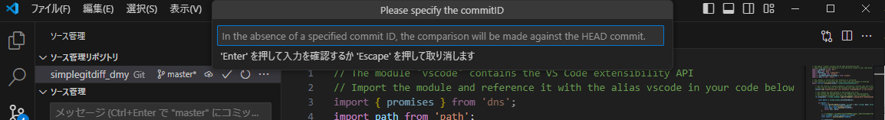
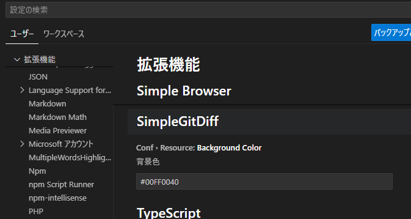

# simplegitdiff README

簡単に現在とワークブランチと指定のコミットIDを比較して、VSCoreのエディタ上に変更箇所を表示するプログラム

A simple program to compare the current state, work branch, and a specified commit ID, and display the changes in the VSCode editor.

↓コマンドパレットから"SimpleGitDiff"を選択(↓Select "SimpleGitDiff" from the command palette)

↓↓比較したいコミットIDを指定、空白ならHEADと比較(Specify the commit ID to compare. If left blank, HEAD will be used for comparison.)

↓例題のコミットIDを指定(Specify the commit ID for the example)

↓git diff↓結果を、エディタに反映させる(View the diff in my editor)

↓設定で背景色の変更が可能(Background color can be changed in the settings)

## Features

VSCodeで現在のエディタのパスを取得して

  git diff [指定コミットID] エディタのファイルパス

を行い編集履歴を取得し、エディタ画面に反映させます

複数のコミットを行い全体の単体テストをするときに、変更箇所を探すのが面倒(コミット結合が手間。。。比較画面があってもブレークを置けなかったり、複数の差分チェックが出来なかったり)だったので作りました

コマンド

|||
|:--|:--|
|SimpleGitDiff|git diffした結果をエディタに反映させる|
|SimpleGitDiffClear|表示していたgit diffの状態を非表示にする|
|SimpleGitDiffUp|現在のカーソル位置から上の変化点に移動する|
|SimpleGitDiffDown|現在のカーソル位置から下の変化点に移動する|
|SimpleGitDiffRe|前回のコミットIDで再度、git diffしてエディタに反映する|

|||
|:--|:--|
|SimpleGitDiff|Reflect the result of git diff in the editor|
|SimpleGitDiffClear|Hide the displayed git diff status.|
|SimpleGitDiffUp|Move to the previous change point from the current cursor position|
|SimpleGitDiffDown|Move to the next change point from the current cursor position|
|SimpleGitDiffRe|Redo a git diff with the previous commit ID and reflect it in the editor|

